<div align="center">

<!-- Animated Header -->
<a href="https://git.io/typing-svg">
  
</a>

<br/>

> *❝ I fight for the users. ❞*

<div align="center">
  <a href="https://marsmcoe.netlify.app/">
    
  </a>
</div>

<br/>

<!-- Social Badges -->
<p>
  <a href="mailto:deepaansh.d.sial@gmail.com"></a>
  <a href="https://www.linkedin.com/in/deepaanshsial/"></a>
</p>

<p>
  
</p>

<!-- Animated Snake -->
<picture>
  <source media="(prefers-color-scheme: dark)" srcset="https://raw.githubusercontent.com/Aanzan426/Aanzan426/output/github-snake-dark.svg" />
  <source media="(prefers-color-scheme: light)" srcset="https://raw.githubusercontent.com/Aanzan426/Aanzan426/output/github-snake.svg" />
  
</picture>

<!-- light trail -->


</div>

---

## 🧠 About Me

```ts
const deepaansh = {
  role: "Full Stack Developer | SLM & ML Enthusiast",
  location: "Pune, India 🇮🇳",
  currentRole: "Full Stack Intern @ Unity Education Solutions | Head of CS/IT/AI @ M.A.R.S Club",
  currentlyLearning: ["Small Language Models", "Machine Learning", "DevOps", "Docker"],
  currentlyWorkingOn: ["school-ERP payments & automations (Frappe/ERPNext)", "SLM & ML experiments", "CubeSat AOCS"],
  loveDiscussing: ["system design", "space systems & attitude control", "emerging tech", "hard problems"],
  funFact: "cleared the NDA written exam 5 times in a row — consistency is a habit",
  openTo: "Collaborations, Frappe/ERPNext work, and hard problems"
};
```

---

## 🛠️ Tech Stack

### Languages & Core
<p>
  
  
</p>

### Databases
<p>
  
  
</p>

### AI Agents & LLM Tooling
<p>
  
  
  
  
  
</p>

### Backend
<p>
  
  
  
  
</p>

### Operating Systems
<p>
  
  
</p>

### DevOps & Tools
<p>
  
</p>

---

## 💼 Behind the Commit Graph

Most of my code lives in private repos — a production ERP platform used daily by real people. The shape of that work:

- 💳 **Payments** — fee-payment flows built end-to-end across multiple payment gateways: hosted checkout, webhook & callback handling, receipts, reconciliation
- 🛡️ **Security** — gateway-wide payment security auditing, permission hardening on public APIs, HMAC-authenticated webhooks, PII leak-scanning
- 🔁 **Automation** — durable, idempotent webhook pipelines with alerting & digest reporting; lifecycle automations run safely over hundreds of thousands of live records
- 🧪 **Testing** — 100+ automated tests shipped alongside features: unit, regression, and live end-to-end runs in a headless browser
- 🧬 **Data** — fully anonymised demo environments with relationally-valid synthetic data — provably clean, zero integrity errors
- 🔍 **Root-cause debugging** — down to framework source when needed: core-level bugs found and fixed, a 12-hour hang traced to a single hidden HTTP fan-out

---

## 🔴 M.A.R.S


Head of the **CS/IT/AI department** at [M.A.R.S](https://github.com/MARS-MCOE), Modern College of Engineering's tech club, and one of the main developers behind the club's **[official website](https://marsmcoe.netlify.app/)**.

I also lead the **Attitude & Orbit Control System** for the college CubeSat mission — the closest my code gets to actually flying.

<br clear="right"/>

---

## 🚀 Projects

<table>
<tr>
<td width="50%" valign="top">

<h3>🔐 <a href="https://github.com/AanZan426/pass-manager-mobile">Vault — Offline Password Manager</a></h3>
<i>Jun 2026</i> — deployed on GitHub Pages, used daily on my own phone

<details>
<summary>Highlights</summary>

- Deterministic high-entropy passwords from one master phrase
- Configurable output entropy up to 64 bits
- No plaintext, no backend, no internet required
</details>


</td>
<td width="50%" valign="top">

<h3>🏫 <a href="https://github.com/AanZan426/Smart-Campus-Resource-Manager">Smart Campus Resource Manager</a></h3>
<i>Jan 2026 – Present</i> — conflict-free booking for classrooms, labs & equipment

<details>
<summary>Highlights</summary>

- Slot-based scheduling with automatic expiry
- Double-booking blocked at the database level
- Admin dashboard for live resource oversight
</details>


</td>
</tr>
<tr>
<td width="50%" valign="top">

<h3>💰 <a href="https://github.com/Evaluers">E-Value — Personal Finance Manager</a></h3>
<i>Nov 2025 – Present · private @Evaluers</i> — eating my own dog food

<details>
<summary>Highlights</summary>

- Tracks real expenses, savings & fund allocation
- Analytics surfacing spending trends over time
- Persistent JSON storage, modular reporting
</details>


</td>
<td width="50%" valign="top">

<h3>📚 <a href="https://github.com/AanZan426/Cannon_Check">CanonCheck</a></h3>
<i>Jan 2026</i> — verifies fictional backstories against canonical texts

<details>
<summary>Highlights</summary>

- Validated similarity-based scoring
- Measured against source canon — not vibes
- Built end-to-end in notebooks
</details>


</td>
</tr>
<tr>
<td width="50%" valign="top">

<h3>🌳 <a href="https://github.com/AanZan426/Green-AI-UHI">Green-AI-UHI</a></h3>
<i>Jan 2026</i> — urban heat island analysis for Pune

<details>
<summary>Highlights</summary>

- Predicts 2027 zone-wise temperatures
- Computes neem trees needed per zone
- Targets a 25 °C median temperature
</details>


</td>
<td width="50%" valign="top">

<h3>⚡ <a href="https://github.com/AanZan426/rapid-serial-visual-presentation">RSVP Speed Reader</a></h3>
<i>Mar 2026</i> — read books word-by-word, fast

<details>
<summary>Highlights</summary>

- Rapid Serial Visual Presentation method
- Optimised for clean chapter-per-file PDFs
- Zero-dependency, browser-based
</details>


</td>
</tr>
</table>

---

## 🏆 Achievements

- 🎖️ **AIR 242 · NDA 154th Course (Navy), 2025** — cleared the written exam **five consecutive times** (150th–154th)
- 🛰️ **Head, Attitude & Orbit Control System (AOCS)** — college CubeSat mission
- 🏹 **District-Level Archery Gold Medalist** (Indian Bow)
- 📜 **Department Topper List** — B.E. AI & DS, 9.77/10 in Semester I · 8.93 CGPA overall
- 🧾 **Certified:** AI Fluency — Anthropic · Cybersecurity, Python for DS, AI Fundamentals, ML with Python — IBM

---

## 📊 GitHub Analytics

<div align="center">
  
  
</div>

<div align="center">
  
</div>

## 📈 Contribution Graph

<div align="center">
  
</div>

---

<div align="center">

### 💬 Let's connect and build something cool together!

*"— END OF LINE —"*


</div>
