<!-- animated wave header -->


<div align="center">

<!-- typing intro -->
<a href="https://git.io/typing-svg">
  
</a>

<p>
  <a href="mailto:deepaansh.d.sial@gmail.com"></a>
  <a href="https://www.linkedin.com/in/deepaanshsial/"></a>
  
</p>

<!-- the shot -->


</div>

## 🎯 Right now

|              |                                                                                                                          |
| -----------: | :----------------------------------------------------------------------------------------------------------------------- |
| **Shipping** | payment, data & automation features on a live school ERP — Full Stack Developer Intern @ Unity Education Solutions        |
|  **Leading** | the CS/IT/AI department at [M.A.R.S](https://github.com/MARS-MCOE) · the attitude-control system of our college CubeSat 🛰️ |
| **Studying** | B.E. AI & Data Science @ Modern College of Engineering, Pune — class of '27 · 8.93 CGPA                                    |
| **Learning** | Docker · WordPress plugin & theme development                                                                              |

## 🚢 Shipped to production

Not side projects — features running on live school-ERP sites used by real schools. **25+ merged PRs, 90+ automated tests** at Unity Education Solutions so far:

- Built the **Instant Fee** payment feature end-to-end: paginated REST APIs, a React/TypeScript infinite-scroll UI localised in three languages, and checkout across **three payment gateways** — Easebuzz, GrayQuest, Razorpay.
- **Found and fixed a permission-bypass vulnerability** in a whitelisted API, then audited the payment-callback chain across all three gateways for missing signature verification.
- Rebuilt a Facebook Lead Ads → ERPNext pipeline to be **durable and idempotent** — HMAC-authenticated webhooks, exactly-once dedup, raw payloads persisted before processing, failure digests to Discord and email. Backed by 22 tests.
- Generated a fully anonymised **synthetic dataset** for a 34-app demo site — after proving clone-and-scrub couldn't be made provably clean across 115+ denormalised text columns — then wrote a PII leak-scanner to keep it that way.
- Automated the purchase-order lifecycle and closed hiring-flow gaps across six HR apps, everything live-verified end-to-end with **Playwright**.

## 🔴 M.A.R.S


Head of the **CS/IT/AI department** at [M.A.R.S](https://github.com/MARS-MCOE), Modern College of Engineering's tech club, and one of the main developers behind the club's **[official website](https://marsmcoe.netlify.app/)**.

I also lead the **Attitude & Orbit Control System** for the college CubeSat mission — the closest my code gets to actually flying.

<br clear="right"/>

## 🧰 Loadout

```text
languages   Python · PHP · SQL · JavaScript/TypeScript · HTML/CSS
backend     Frappe/ERPNext · REST API design · webhooks & integrations · Jinja
frontend    React + TypeScript · vanilla JS when it's enough
data        MariaDB/MySQL — schema design, indexing, query optimisation · ETL · synthetic data
testing     Playwright · unit & regression suites · permission test suites
tools       Git/GitHub · Frappe bench · Pabbly Connect
learning    Docker · WordPress plugin & theme development
```

## 🛠️ Things I've built

**[Vault — offline password manager](https://github.com/AanZan426/pass-manager-mobile)** — deterministic, high-entropy passwords derived from a single master phrase; nothing leaves the browser, nothing stored in plaintext. Deployed on GitHub Pages and used daily on my own phone. `JavaScript · crypto hashing · GitHub Pages`

**[Smart Campus Resource Manager](https://github.com/AanZan426/Smart-Campus-Resource-Manager)** — booking system for classrooms, labs and equipment where double-booking is impossible by design: relational constraints at the database level, a slot algorithm with automatic expiry, and an admin dashboard on top. `PHP · MySQL · JavaScript`

**E-Value — personal finance manager** *(private · [@Evaluers](https://github.com/Evaluers))* — tracks my actual expenses, savings and fund allocations, with analytics that show where the money really goes. Eating my own dog food since Nov 2025. `Python · JSON · data analytics`

**[CanonCheck](https://github.com/AanZan426/Cannon_Check)** — a validated, similarity-based system that verifies fictional character backstories against the canonical texts. Measured, not vibes. `Python · Jupyter · NLP`

**[Green-AI-UHI](https://github.com/AanZan426/Green-AI-UHI)** — predicts 2027 zone-wise temperatures for Pune, then computes how many neem trees each zone needs to cool back down to a 25 °C median. `Python · predictive modelling`

**[RSVP Reader](https://github.com/AanZan426/rapid-serial-visual-presentation)** — speed-reading app that flashes books word-by-word using Rapid Serial Visual Presentation, built for clean chapter-per-file PDFs. `HTML · JavaScript · Python`

## 🏹 Off the keyboard

- **AIR 242 · NDA 154th Course (Navy), 2025** — cleared the written exam **five consecutive times** (150th–154th).
- **District-level archery gold medalist**, Indian bow. Aim small, miss small.
- **Department topper list**, B.E. AI & DS — 9.77/10 in Semester I, 8.93 CGPA overall.

**Certified:** AI Fluency — Anthropic ('26) · Cybersecurity Fundamentals, Python for Data Science, AI Fundamentals, ML with Python L1 — IBM ('26)

## 📊 Telemetry

<div align="center">
  
  
</div>

<div align="center">
  
</div>

<!-- contribution snake -->
<div align="center">
  <picture>
    <source media="(prefers-color-scheme: dark)" srcset="https://raw.githubusercontent.com/Aanzan426/Aanzan426/output/github-snake-dark.svg"/>
    
  </picture>
</div>

<div align="center">

**[deepaansh.d.sial@gmail.com](mailto:deepaansh.d.sial@gmail.com)** — always up for Frappe questions, hard problems, or a round of archery.

</div>

<!-- animated wave footer -->

